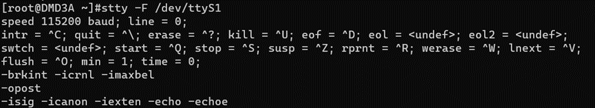
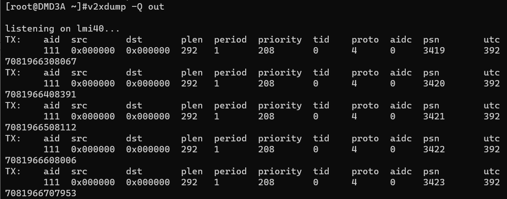

<h2>html:
offline: true
export_on_save:
html: true</h2>

V2X模组：大唐DMD3A

<h2>测试工具</h2>

5G云控天线：

天线接入方案：

<h2>测试</h2>
<ol>
<li>查看模组状态，是否为<code>active</code>，若模组正常返回<code>active</code>，则表示激活成功</li>
</ol>
<pre><code># 进入v2x系统, 密码root
ssh root@192.168.62.199
# 使用athelper工具
athelper
# 查询v2x状态
at+irms
</code></pre>

<ol>
<li>查看v2x波特率，出厂波特率设置为<code>115200</code>，若不是<code>115200</code>，则需要修改</li>
</ol>
<pre><code># 进入v2x系统, 密码root
ssh root@192.168.62.199
# 查看v2x波特率
stty -F /dev/ttyS1
</code></pre>

<ol>
<li>查看模组是否正常发送BSM包</li>
</ol>
<pre><code># 进入v2x系统, 密码root
ssh root@192.168.62.199
# 查询是否在发BSM包
v2xdump -Q out
</code></pre>

<h2>修改波特率方法</h2>

方法一：使用命令修改

<pre><code># 进入v2x系统, 密码root
ssh root@192.168.62.199
# 修改波特率为115200
stty -F /dev/ttyS1 115200
</code></pre>

方法二：使用上位机修改
使用gLMT软件在设备参数中配置串口波特率，此步骤在v2x刷写文档中已操作过，如果波特率不正确说明刷写后没有进行正确配置，需手动配置图中四个地方：

