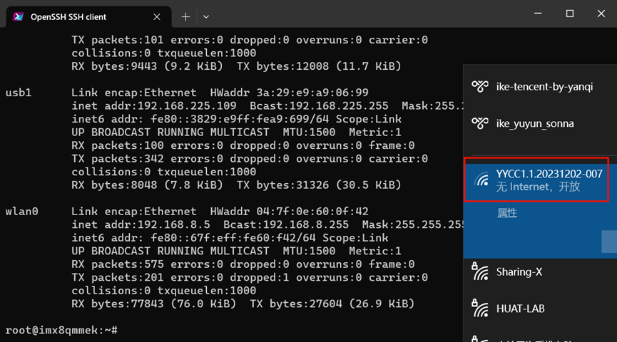

<h2>html:
offline: true
export_on_save:
html: true</h2>

<h2>修改WIFI名称</h2>

出厂前需要修改WIFI名称为对应控制器SN号，修改方法：

<pre><code># 进入8qm系统运行以下命令, 其中xxxxxx需更改为对应控制器的SN号
sed -i &#39;s/ssid=brt_wifi_test/ssid=xxxxxx/g&#39; /etc/config_file/hostapd_5g.conf
</code></pre>

控制器重启后WIFI名就可以更改成功了

<h2>测试</h2>

要求：可以正常连接WIFI进入imx8qm系统

<pre><code>ssh root@192.168.8.5
# ifconfig显示的wlan0是wifi的网卡
ifconfig -a
</code></pre>

截图：

