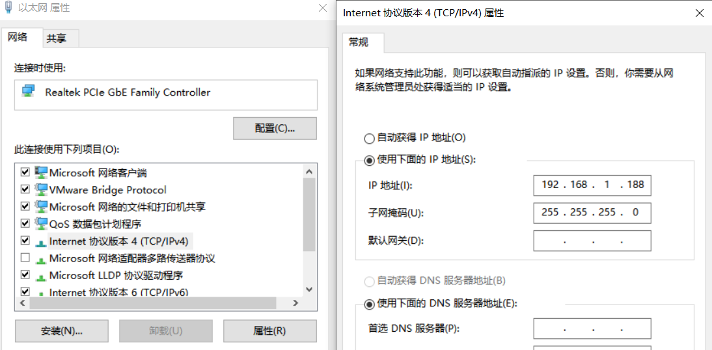

<h2>html:
offline: true
export_on_save:
html: true</h2>

<h2>测试工具</h2>

M12转RJ45网线：

<h2>测试</h2>

要求：通过两工业以太网口均可进入系统
测试前确认与控制器所接的网口ip处于192.168.1.0/24网段，同时不能和5G控制器的ip<code>192.168.1.100</code>一致

网口位置：

截图：

