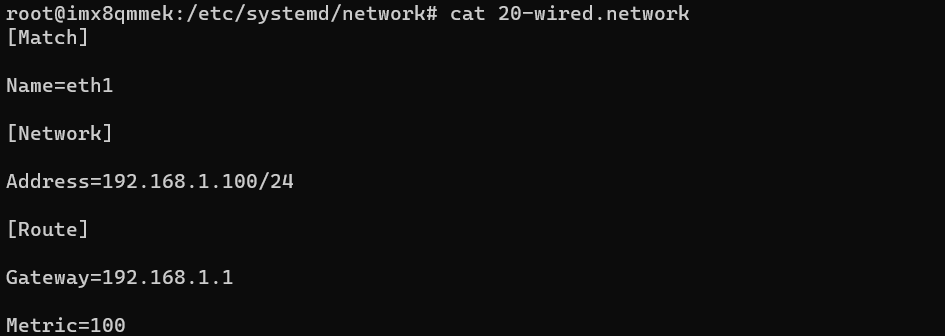

<h2>html:
offline: true
export_on_save:
html: true</h2>

<h2>测试</h2>

要求：5G网口的地址为<code>192.168.1.100</code>，mac地址为<code>aa:bb:cc:dd:ee:ff</code>

<pre><code>ifconfig -a
</code></pre>

截图：

<h2>修改方法</h2>
<ul>
<li>修改ip地址</li>
</ul>

编辑<code>/etc/systemd/network/20-wired.network</code>，修改eth1网卡ip地址

<ul>
<li>修改mac地址</li>
</ul>

该步骤解决了车上同时安装<code>5G云控控制器</code>及<code>hmi控制器</code>出现mac地址冲突的问题，需在开机自启中文件中修改mac地址

首先，编辑<code>/etc/rc.local</code>在<code>exit 0</code>位置上方添加

<pre><code>bash /home/root/re_eth1.sh &amp;
</code></pre>

然后，下载re_eth1.sh：re_eth1.sh，将该文件放进imx8qm系统<code>/home/root/</code>目录下
re_eth1.sh内容为：

<pre><code>#!/bin/bash

sleep 5

ifconfig eth1 down
ifconfig eth1 hw ether AA:BB:CC:DD:EE:FF
ifconfig eth1 up
</code></pre>

重启控制器系统，检查是否修改成功

