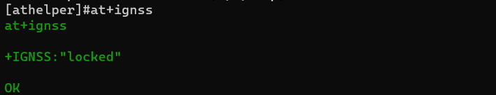

<h2>html:
offline: true
export_on_save:
html: true</h2>

GNSS：支持GPS/北斗定位

<h2>测试工具</h2>

5G云控天线：

天线接入方案：

<h2>测试</h2>

进入v2x系统，使用<code>athelper</code>工具，若ignss为locked，GPS功能则正常；在室外空旷情况下，插了天线，一般上电后3分钟将会<code>locked</code>，若长时间没有lock说明有问题

<pre><code># 进入v2x系统, 密码root
ssh root@192.168.62.199
# 使用athelper工具
athelper
# 查询gnss状态
at+ignss
</code></pre>

截图：

