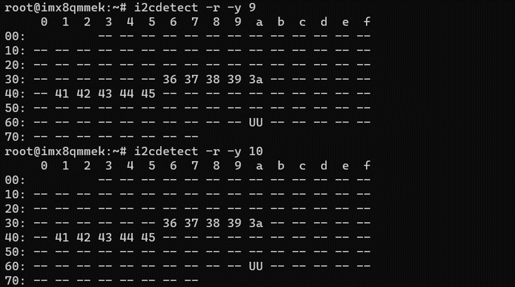
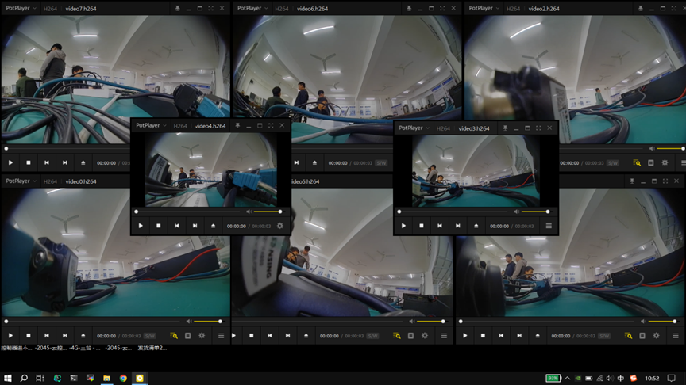

<h2>html:
offline: true
export_on_save:
html: true</h2>

相机接入支持GMSL x8路

<h2>测试工具</h2>

两束GMSL视频线束，8颗森云相机：

<h2>测试</h2>

要求：检测到8路摄像头，并且都能出图

<ol>
<li>检测i2c地址</li>
</ol>
<pre><code># 查找i2c总线9上存在的设备，其中41,42,43,44代表四路相机的地址
i2cdetect -r -y 9
# 查找i2c总线10上存在的设备
i2cdetect -r -y 10
</code></pre>

截图：

<ol>
<li>相机出图</li>
</ol>

下载相机检测工具和脚本：
camera_test.out：视频录制程序，能够打开参数中规定的相机并录制3秒视频

<pre><code># 你可以调用video0~7
chmod +x camera_test.out
./camera_test.out video0
</code></pre>

这里可以创建一个脚本，依次运行每一路的相机画面，例如：

<pre><code>#!/bin/bash

rm camera_test.h264
./camera_test.out video0 &amp;&amp; mv camera_test.h264 video0.h264
./camera_test.out video1 &amp;&amp; mv camera_test.h264 video1.h264
./camera_test.out video2 &amp;&amp; mv camera_test.h264 video2.h264
./camera_test.out video3 &amp;&amp; mv camera_test.h264 video3.h264
./camera_test.out video4 &amp;&amp; mv camera_test.h264 video4.h264
./camera_test.out video5 &amp;&amp; mv camera_test.h264 video5.h264
./camera_test.out video6 &amp;&amp; mv camera_test.h264 video6.h264
./camera_test.out video7 &amp;&amp; mv camera_test.h264 video7.h264
</code></pre>

正常会生成.h264的视频文件，放在本地，我们可以用potplayer等软件检查视频图像是否正常

截图：

