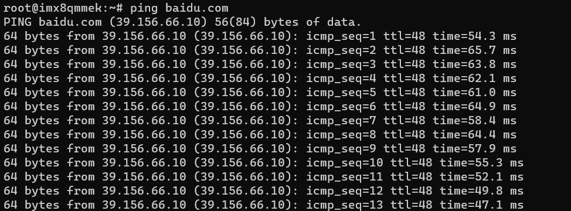

<h2>html:
offline: true
export_on_save:
html: true</h2>

5G模组：移远AG551Q

<h2>测试工具</h2>

天线、支持5G，可以正常上网的SIM卡：

将控制器放进卡槽：

正确接入天线：

<h2>测试</h2>

进入控制器访问外网，如果可以访问外网说明5G功能正常

<pre><code># ping外网
ping baidu.com
</code></pre>

截图：

