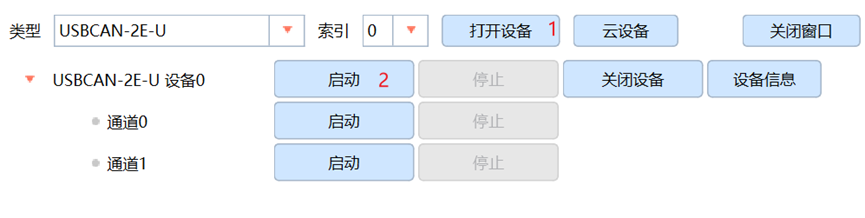
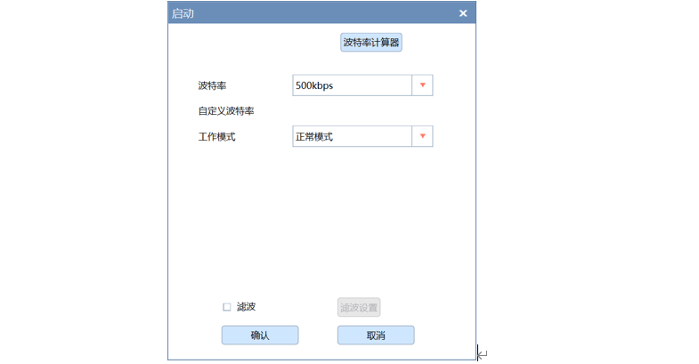
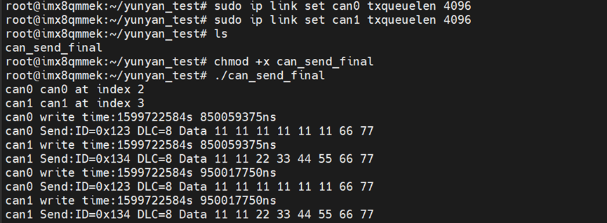
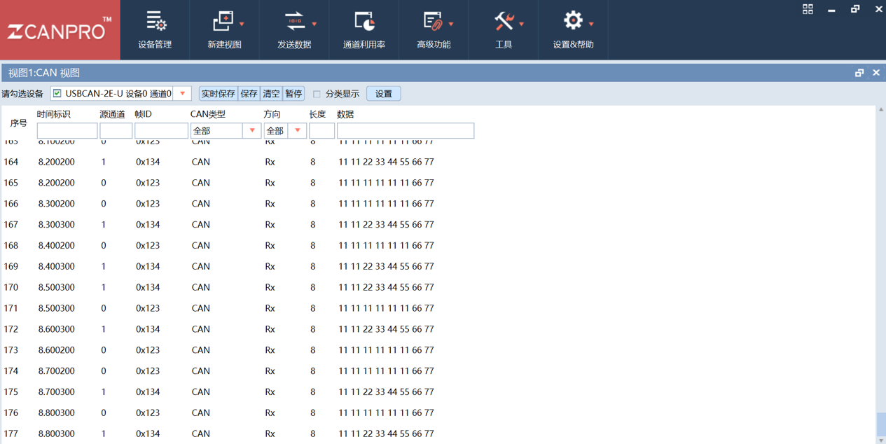

<h2>html:
offline: true
export_on_save:
html: true</h2>

<h2>测试工具</h2>

USBCAN盒：

<h2>CAN/CANFD 自启</h2>

检查im8qm系统自启文件<code>/etc/rc.local</code>是否已开启can，若没有，则需要手动添加

<pre><code># 查看自启文件
cat /etc/rc.local
</code></pre>

创建文档时，imx8qm最新版本为#YY202401235GV1P4，自启文件已配置该项

<h2>测试</h2>

提前下载 ZCANPRO 软件，下载对应CAN盒驱动；使用CAN盒连接上电源线束的<code>MCU-CAN3</code>、<code>ARM-CAN4</code>，注意高低电平不要接反；CAN盒的USB线束连接电脑，打开 ZCANPRO ，选择对应的设备类型，依次点击打开设备，启动

波特率选择500kbps后，点击确认

先修改一下缓存大小，在imx8qm中输入：

<pre><code>ip link set can0 txqueuelen 4096
ip link set can1 txqueuelen 4096
</code></pre>

下载can测试程序：<a href="../../../public/files/can_send_final" rel="nofollow">can_send_final</a>
将程序放入控制器中，在有这个测试文件的目录下运行：

<pre><code>chmod +x can_send_final
./can_send_final
</code></pre>

该程序会在两个线路上分别发送一组数据

若ZCANPRO可以接收到这两组数据，则说明CAN测试正常：

